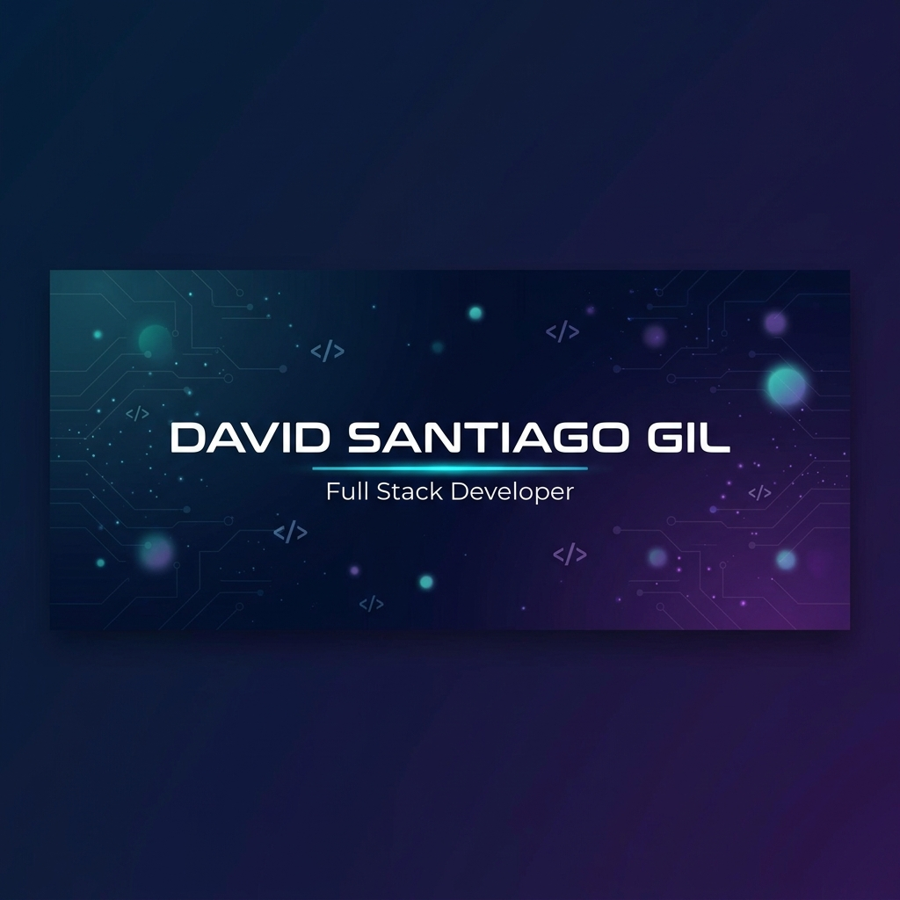
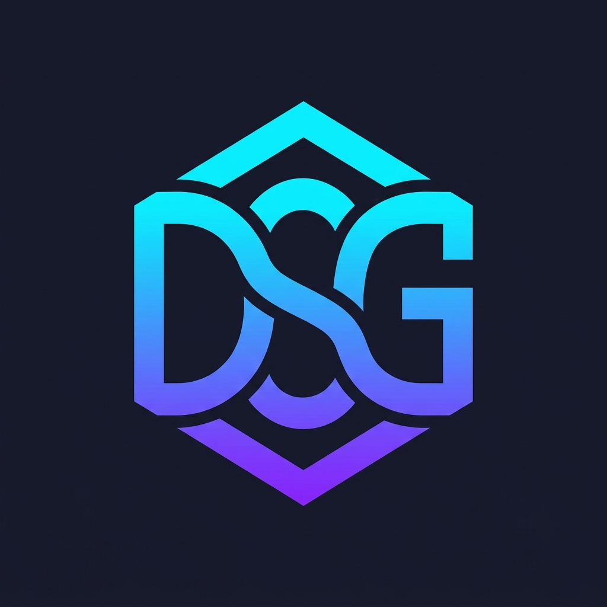

<p align="center">
  
</p>

<p align="center">
  
</p>

<p align="center">
  <a href="https://git.io/typing-svg">
    
  </a>
</p>

<p align="center">
  <a href="https://linkedin.com/in/david-santiago-gil-cifuentes">
    
  </a>
  <a href="mailto:gilsantiagodepa@gmail.com">
    
  </a>
  <a href="https://github.com/David-Santiago-Gil">
    
  </a>
</p>

<p align="center">
  
  
</p>


## 🧑‍💻 Sobre Mí

```javascript
const david = {
    ubicación: "Funza, Cundinamarca, Colombia 🇨🇴",
    educación: "Tecnólogo ADSO — SENA (5° de 6 trimestres)",
    rol: "Desarrollador Full Stack Junior",
    idiomas: ["Español (Nativo)", "Inglés (B1 → B2+)"],
    
    intereses: [
        "🔭 Búsqueda de primera oportunidad profesional",
        "🌱 Mejorando activamente mi inglés",
        "⚡ Creando soluciones web dinámicas y responsivas",
        "🤝 Disponibilidad inmediata"
    ],
    
    dato_curioso: "Transformo café ☕ en código limpio 💻"
};
```


## 🛠️ Tech Stack

<details open>
<summary><b>⚡ Frontend</b></summary>
<br/>
<p align="center">
  <a href="#"></a>
</p>
</details>

<details open>
<summary><b>⚙️ Backend & APIs</b></summary>
<br/>
<p align="center">
  <a href="#"></a>
</p>
</details>

<details open>
<summary><b>💾 Bases de Datos</b></summary>
<br/>
<p align="center">
  <a href="#"></a>
  
  
</p>
</details>

<details open>
<summary><b>☁️ Despliegue & DevOps</b></summary>
<br/>
<p align="center">
  <a href="#"></a>
  
  
  
</p>
</details>


## 🚀 Proyectos Destacados

<table>
  <tr>
    <td width="50%" valign="top">
      <h3 align="center">🎬 MovieNexus</h3>
      <p align="center">
        <a href="https://github.com/David-Santiago-Gil/MovieNexus">
          
        </a>
      </p>
      <p>
        Catálogo interactivo de películas que consume la API de <b>TMDB</b>. Búsquedas en tiempo real, trailers, calificaciones y lista de favoritos persistente.
      </p>
      <p align="center">
        
        
        
        
      </p>
    </td>
    <td width="50%" valign="top">
      <h3 align="center">📝 Gestor de Tareas</h3>
      <p align="center">
        <a href="https://github.com/David-Santiago-Gil/gestor_tareas">
          
        </a>
      </p>
      <p>
        Plataforma <b>Full Stack</b> para administración visual de tareas. Organiza por estado y prioridad con operaciones CRUD completas.
      </p>
      <p align="center">
        
        
        
        
      </p>
    </td>
  </tr>
  <tr>
    <td width="50%" valign="top">
      <h3 align="center">⚡ FARM Stack CRUD</h3>
      <p align="center">
        <a href="https://github.com/David-Santiago-Gil/Farm_Stack_Crud">
          
        </a>
      </p>
      <p>
        App Full Stack con el moderno <b>FARM Stack</b>. Backend de alto rendimiento con <b>FastAPI</b> y frontend interactivo en <b>React</b>.
      </p>
      <p align="center">
        
        
        
        
      </p>
    </td>
    <td width="50%" valign="top">
      <h3 align="center">🎰 NeonRoyale Casino</h3>
      <p align="center">
        <a href="https://github.com/David-Santiago-Gil/casino">
          
        </a>
      </p>
      <p>
        Interfaz de entretenimiento con estética <b>neón retro-futurista</b>. CSS avanzado con efectos glow, transiciones suaves y componentes reutilizables.
      </p>
      <p align="center">
        
        
        
        
      </p>
    </td>
  </tr>
</table>


## 📜 Educación & Certificaciones

<table>
  <tr>
    <td>🎓</td>
    <td><b>Tecnólogo en Análisis y Desarrollo de Software (ADSO)</b></td>
    <td>SENA</td>
    <td></td>
  </tr>
  <tr>
    <td>🤖</td>
    <td><b>Inteligencia Artificial Fundamentals</b></td>
    <td>IBM SkillsBuild</td>
    <td><a href="https://credly.com/badges/71c8be4e-7200-4f22-84ff-10136c39930"></a></td>
  </tr>
  <tr>
    <td>📦</td>
    <td><b>Técnico en Integración de Operaciones Logísticas</b></td>
    <td>SENA</td>
    <td></td>
  </tr>
</table>


## 📊 GitHub Analytics

<p align="center">
  
  
</p>

<p align="center">
  
</p>

<p align="center">
  
</p>


<p align="center">
  
</p>

<p align="center">
  <i>💬 ¿Tienes una oportunidad o proyecto en mente? ¡No dudes en contactarme!</i>
</p>
